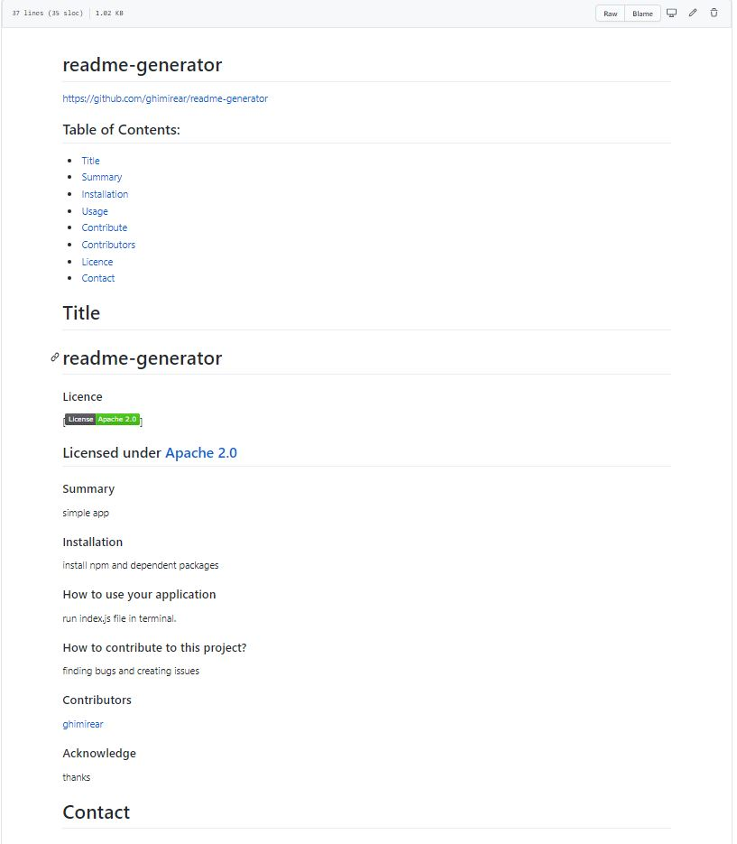

# readme-generator
## About This Project
**readme-generator** is an simple app that allows user to input their data on the basis of pre sets of questions and on the basis of those answers it generates a standard, professional readme file within a seconds.
### installation 
To install this program first install nodejs and then dependent packages like inquirer fs.
## features
- It allows to put contributor(s).
- Staandard license badge and link to the licensing page.
- Gives an place for to input contact.
### sample

